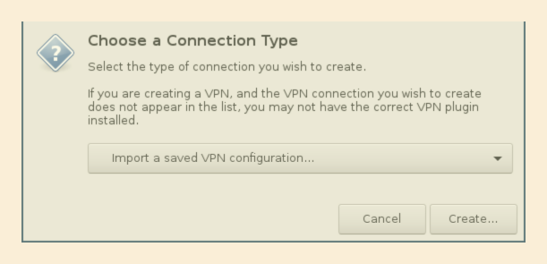

# step by step guide to connecting to a VPN

This guide assumes you've got an inline OpneVPN config file, such as those generated by pfSense's
OpenVPN Client Export Utility. It also makes a bunch of other assumptions I'm not getting into right
now. Updates will happen eventually!


## 0. Setup (only needed once)
You need to grab a copy of this repo. This guide will assume it's in your home folder, but it
doesn't need to be there and many will likely prefer it elsewhere.

```bash
git clone https://github.com/thefinn93/openvpn-config-splitter ~/openvpn-config-splitter
```

## 1. Split the config
```bash
cd ~/openvpn-config-splitter
python ./split.py /path/to/config.ovpn
```

This will give you a file path to go and import. It uses a couple of things to guess a reasonable
name for the files. Unfortunately, the name will likely suck. Go ahead an copy the path to the file.

## 2. Import the config
Open the add network dialog. The exact way to get this open via the GUI varies across Network Manager
versions, but pressing `alt-f2`, typing `nm-connection-editor` and hitting enter will open the
connection editor, from which you can hit the big Add button on the right. You're looking for a
dialog box like this:



Change the dropdown to "Import a saved VPN configuration..." as shown in the above screenshot, and
click "Create". It will prompt you to select a file, select the file from step 1. If you still have
the full path in your clipboard, you can hit ctrl-L for a text entry box that the path can be pasted
in.

## 3. Finishing touches
You are presented with a dialog that allows you to change all of the VPN settings. Change the
connection name (at the top) to something more human friendly. You can use things like apostrophes
and spaces! Next, go into the IPv4 Settings tab, click "Routes", and select "Use this connection
only for resources on its network". 
